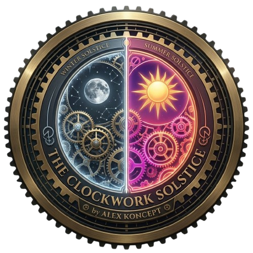

# ⚙️ The Clockwork Solstice

<p align="center">
  
</p>

<p align="center">
  <a href="https://github.com/AlexKoncept/the-clockwork-solstice/blob/main/LICENSE"></a>
  
  
  
  
  
</p>

<p align="center">
  <a href="https://theclockworksolstice-byalexkoncept.netlify.app/" target="_blank">
    
  </a>
</p>

---

## 📊 Project Infographics

<p align="center">
  
</p>

---

### 🌐 English Version

An exquisite, highly interactive creative-coding monument bridging the age-old elegance of mechanic horology, watch modding, and digital aesthetics. Crafted by **Alex Koncept**.

### 🌸 Passion & Philosophy
Born from a genuine obsession with high-precision mechanical watchmaking, watch modding, and astronomical complications, **The Clockwork Solstice** is designed to translate physical tactile aesthetics into digital animation. It connects the meticulous mathematical flow of gears, escapements, and calibrating springs with real-time browser dynamics and physics equations. It is a sensory celebration of time, astronomy, and digital craftsmanship.

### 🌓 Core Dual-Theming Architecture
At the absolute center of this ecosystem lies the **Celestial Globe Selector**, enabling users to instantly cycle between two radically distinct astronomic states:
* **Winter Solstice (Solstice d'Hiver)**: An elegant, high-contrast dark space. Deep charcoal and rich slate grays paired with vintage amber highlights (`#D4A359`). Captures the quiet composure of cold starry nights, featuring a traditional ticking escapement aesthetic.
* **Summer Solstice (Solstice d'Été)**: A vibrant, sun-drenched light mode. An ethereal white, rose, and warm sunny gradient background paired with neon pink accents, backing aura glows, and high-energy dynamics, celebrating the absolute peak of solar abundance.

### 🚀 Key Features
1. **The Interactive Celestial Globe Toggle**: A premium, custom-drawn 28px split globe element. The circular layout is split perfectly in half—a dark core (`#0B0D0F`) on the left and a glowing hot coral/neon pink on the right. Animates on hover (`hover:scale-110`) and plays audio feedback on tap.
2. **Physical Gear Escapement Visuals**: Beautiful vector-calculated clock gears rotating endlessly to simulate internal mainspring watch kinetics.
3. **Glassmorphic HUD Layout**: Polished, responsive header and detail panels utilizing premium glassmorphism effects (`backdrop-blur-xl`).
4. **Audio Synthesis Layer**: Uses a dedicated high-fidelity Web Audio API engine to provide crisp mechanical ticks and celestial ambient sound waves in real-time.
5. **Multi-Lingual Architecture**: Fully synchronized English and French localizations (`en` / `fr`) mapping technical horological terms across the simulator.

---

### 🌐 Version Française

Un monument de code créatif exquis et hautement interactif, mêlant l'élégance séculaire de l'horlogerie mécanique, du modding de montres et de l'esthétique numérique. Conçu par **Alex Koncept**.

### 🌸 Passion & Philosophie
Né d'une véritable obsession pour l'horlogerie mécanique de haute précision, le modding et les complications astronomiques, **The Clockwork Solstice** est conçu pour traduire l'esthétique tactile du monde physique en animation numérique. Il connecte le flux mathématique minutieux des engrenages, des échappements et des ressorts de réglage avec la dynamique en temps réel du navigateur. C'est une célébration sensorielle du temps, de l'astronomie et de l'artisanat numérique.

### 🌓 Architecture Double Thème
Au centre absolu de cet écosystème se trouve le **Sélecteur de Globe Céleste**, permettant aux utilisateurs d'alterner instantanément entre deux états astronomiques radicalement distincts :
* **Solstice d'Hiver**: Un espace sombre élégant et hautement contrasté. Des gris ardoise et anthracite profonds associés à des reflets ambrés vintage (`#D4A359`), capturant le calme des nuits froides et étoilées.
* **Solstice d'Été**: Un mode lumineux vibrant et ensoleillé. Un arrière-plan dégradé blanc, rose et chaud associé à des accents rose néon et des lueurs d'ambiance à haute énergie, célébrant le pic absolu de l'abondance solaire.

### 🚀 Fonctionnalités Clés
1. **Le Toggle Globe Céleste Interactif**: Un composant de globe séparé de 28px. Le tracé circulaire est divisé en deux : un noyau sombre (`#0B0D0F`) à gauche et un rose néon éclatant à droite. Il s'anime au survol (`hover:scale-110`) et joue un son mécanique au clic.
2. **Visuels d'Échappement d'Engrenages Physiques**: De magnifiques engrenages calculés en vecteurs tournant perpétuellement pour simuler la cinétique interne d'un ressort moteur.
3. **Interface HUD Glassmorphique**: Des panneaux réactifs utilisant des effets de flou de verre haut de gamme (`backdrop-blur-xl`) pour une grande profondeur visuelle.
4. **Couche de Synthèse Audio**: Utilise l'API Web Audio pour générer en temps réel des cliquetis mécaniques nets et des nappes sonores célestes sans aucun fichier audio lourd.
5. **Architecture Bilingue**: Localisation complète et synchronisée en anglais et en français (`en` / `fr`) adaptant les termes horologiques techniques.

---

## 🛠️ Technical Stack / Stack Technique

* **Frontend Library**: [React 18+](https://react.dev/) + [TypeScript](https://www.typescriptlang.org/)
* **Build Tool**: [Vite](https://vite.dev/)
* **Styling Engine**: [Tailwind CSS](https://tailwindcss.com/)
* **Animation Layer**: [Framer Motion](https://motion.dev/) (`motion/react`)
* **Sound Synthesis**: Web Audio API
* **Icons**: [Lucide React](https://lucide.dev/)

---

## 📦 Quick Local Setup / Installation Locale

### Prerequisites / Prérequis
Make sure you have [Node.js](https://nodejs.org/) installed (v18+ recommended).

### Installation
1. Clone or download this repository.
2. Open your terminal inside the project root folder.
3. Install all required dependencies:
    ```bash
    npm install
    ```

### Development Server / Serveur de Développement
Run the local Vite development server:
```bash
npm run dev
    ```

### Development Server
Run the local Vite development server to launch the live interactive preview:
```bash
npm run dev
```
Open your browser and navigate to `http://localhost:3000` (or the port specified in your terminal output) to explore.

### Production Build
To compile the application into standard, optimized, minified static files within the `dist/` directory:
```bash
npm run build
```

---

## 📄 License
This project is licensed under the **MIT License**—see the included [LICENSE](./LICENSE) file for complete details. Developed with love by **Alex Koncept** in 2026.
